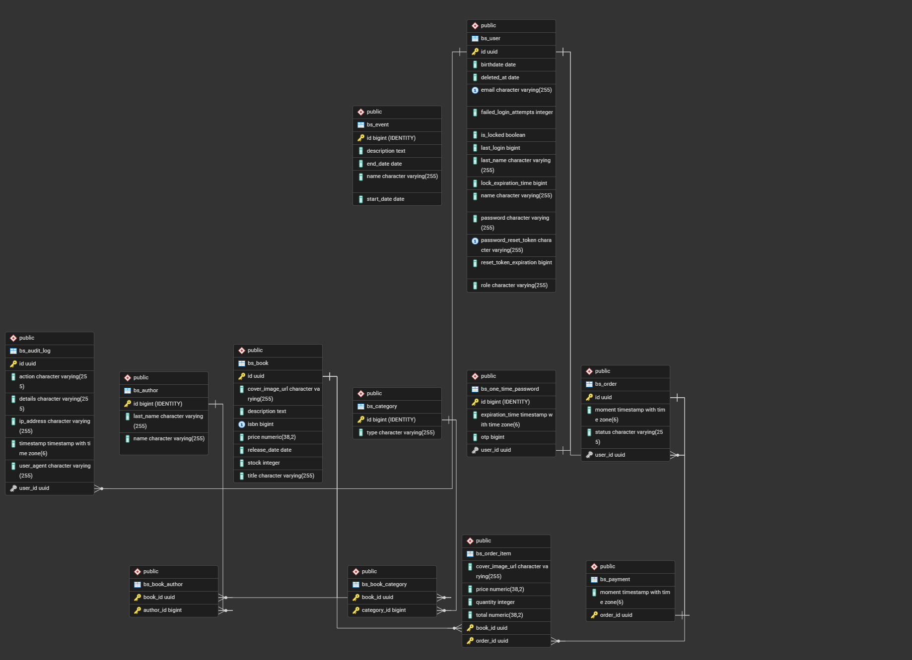

# Bookstore API

[](https://openjdk.org/)
[](https://spring.io/projects/spring-boot)
[](https://maven.apache.org/)
[](https://www.postgresql.org/)
[](https://redis.io/)
[](https://www.docker.com/)

A backend API for an online bookstore that manages users, authentication, catalog (books/authors/categories), orders/cart, audit logs, and supporting services (email, Redis token blacklist, and AI-assisted reader discovery).

This system solves the core operational problems of a bookstore platform by centralizing catalog management, purchase flow, and authentication/security rules in a single API.

<!-- TODO: Replace/add repository-specific badges (build status, coverage, license) once CI and public repository URLs are finalized. -->

---

## Technologies Used

- Java (Spring Boot)
- Spring Web MVC
- Spring Data JPA
- Spring Security
- PostgreSQL
- Redis
- OpenAPI/Swagger (springdoc)
- Maven
- Docker / Docker Compose
- MailHog (local SMTP testing)
- Stripe Java SDK
- ModelMapper / MapStruct
- JUnit 5 + Mockito

---

## Prerequisites

Install these locally before running the project:

- JDK 21+ (recommended: Temurin/OpenJDK)
- Maven 3.9+
- PostgreSQL 17+ (or compatible)
- Redis 7+
- Git
- Docker Desktop (only if you want to run with Docker)

Optional but helpful:

- Postman / Insomnia (for API testing)
- pgAdmin / DBeaver (for DB inspection)

---

## Environment Variables

The application reads configuration from environment variables (especially via `application.properties`).

### Required variables

| Variable | Required | Purpose | Example (Dummy) |
|---|---|---|---|
| `DB_URL` | Yes | JDBC URL for PostgreSQL | `jdbc:postgresql://localhost:5432/bookstore_db` |
| `DB_USER` | Yes | PostgreSQL username | `bookstore_user` |
| `DB_PASSWORD` | Yes | PostgreSQL password | `bookstore_password` |
| `REDIS_HOST` | Yes (or default) | Redis host (`localhost` default) | `localhost` |
| `REDIS_PORT` | Yes (or default) | Redis port (`6379` default) | `6379` |
| `REDIS_PASSWORD` | Optional | Redis password (empty for local dev) | `` |
| `GEMINI_API_KEY` | Optional/Feature-based | API key for AI reader discovery integration | `your_gemini_key_here` |
| `STRIPE_SECRET_KEY` | Optional/Feature-based | Stripe secret key | `sk_test_xxx` |
| `STRIPE_WEBHOOK_SECRET` | Optional/Feature-based | Stripe webhook signing secret | `whsec_xxx` |
| `FRONTEND_URL` | Optional/Feature-based | Allowed frontend URL / app integration URL | `http://localhost:3000` |

### Variables used by `docker-compose.yml`

| Variable | Required (Docker) | Purpose | Example (Dummy) |
|---|---|---|---|
| `POSTGRES_PWD` | Yes | Password passed to Postgres container | `bookstore_password` |
| `POSTGRES_NAME` | Yes | Database name created in container | `bookstore_db` |
| `POSTGRES_USER` | Yes | Postgres username created in container | `bookstore_user` |
| `POSTGRES_URL` | Yes | JDBC URL used by API container | `jdbc:postgresql://db:5432/bookstore_db` |
| `GEMINI_API_KEY` | Optional | Passed to API container | `your_gemini_key_here` |
| `STRIPE_SECRET_KEY` | Optional | Passed to API container | `sk_test_xxx` |
| `STRIPE_WEBHOOK_SECRET` | Optional | Passed to API container | `whsec_xxx` |
| `FRONTEND_URL` | Optional | Passed to API container | `http://localhost:3000` |

Create a local `.env` file (for Docker) and/or export env vars in your terminal (for local run).

<!-- TODO: Confirm final variable list for production deployment and secret management strategy (Vault/GitHub Secrets/etc.). -->

---

## Local Setup (Without Docker)

### 1) Clone repository

```bash
git clone <YOUR_REPOSITORY_URL>
cd bookstore
```

<!-- TODO: Replace `<YOUR_REPOSITORY_URL>` with your actual Git repository URL. -->

### 2) Create PostgreSQL database and user

```bash
psql -U postgres
```

Then run:

```sql
CREATE DATABASE bookstore_db;
CREATE USER bookstore_user WITH PASSWORD 'bookstore_password';
GRANT ALL PRIVILEGES ON DATABASE bookstore_db TO bookstore_user;
```

### 3) Start Redis locally

If installed as service, ensure Redis is running on `localhost:6379`.

### 4) Export environment variables

```bash
export DB_URL="jdbc:postgresql://localhost:5432/bookstore_db"
export DB_USER="bookstore_user"
export DB_PASSWORD="bookstore_password"
export REDIS_HOST="localhost"
export REDIS_PORT="6379"
export REDIS_PASSWORD=""
export GEMINI_API_KEY="your_gemini_key_here"
export STRIPE_SECRET_KEY="sk_test_xxx"
export STRIPE_WEBHOOK_SECRET="whsec_xxx"
export FRONTEND_URL="http://localhost:3000"
```

Windows PowerShell equivalent:

```powershell
$env:DB_URL="jdbc:postgresql://localhost:5432/bookstore_db"
$env:DB_USER="bookstore_user"
$env:DB_PASSWORD="bookstore_password"
$env:REDIS_HOST="localhost"
$env:REDIS_PORT="6379"
$env:REDIS_PASSWORD=""
$env:GEMINI_API_KEY="your_gemini_key_here"
$env:STRIPE_SECRET_KEY="sk_test_xxx"
$env:STRIPE_WEBHOOK_SECRET="whsec_xxx"
$env:FRONTEND_URL="http://localhost:3000"
```

### 5) Run the application

```bash
mvn spring-boot:run
```

By default, API starts on:

- `http://localhost:8080`

---

## Docker Instructions

### 1) Create `.env` file in project root

Example `.env`:

```env
POSTGRES_PWD=bookstore_password
POSTGRES_NAME=bookstore_db
POSTGRES_USER=bookstore_user
POSTGRES_URL=jdbc:postgresql://db:5432/bookstore_db
GEMINI_API_KEY=your_gemini_key_here
STRIPE_SECRET_KEY=sk_test_xxx
STRIPE_WEBHOOK_SECRET=whsec_xxx
FRONTEND_URL=http://localhost:3000
```

### 2) Build and start all containers

```bash
docker compose up -d --build
```

### 3) Verify containers are running

```bash
docker compose ps
```

Expected containers:

- `my_postgres_db`
- `bookstore-redis`
- `mail-server`
- `my-api-container`

### 4) Check API logs (optional)

```bash
docker compose logs -f my-api
```

### 5) Stop environment

```bash
docker compose down
```

To also remove volumes:

```bash
docker compose down -v
```

---

## API Documentation (Swagger)

After starting the app, access:

- Swagger UI: `http://localhost:8080/swagger-ui/index.html`
- OpenAPI JSON: `http://localhost:8080/v3/api-docs`

### How to use Swagger quickly

1. Open Swagger UI in your browser.
2. Expand an endpoint group (e.g., books, users, auth).
3. Click **Try it out**.
4. Fill request fields/body.
5. Click **Execute** to test and inspect response.

If authentication is required for a route, first authenticate through the auth endpoint and pass the JWT token in the `Authorization: Bearer <token>` header.

---

## Usage / Testing

### Run test suite

```bash
mvn test
```

### Run a specific test class

```bash
mvn -Dtest=AuditLogServiceTest test
```

### Example API interactions

#### Authenticate user

```bash
curl -X POST "http://localhost:8080/authenticate" \
  -H "Content-Type: application/json" \
  -d '{"username":"user@example.com","password":"123456"}'
```

#### List books

```bash
curl -X GET "http://localhost:8080/api/books"
```

#### Get author by ID

```bash
curl -X GET "http://localhost:8080/api/authors/1"
```

---

## Project Notes

- The current setup relies on JPA/Hibernate schema management settings; ensure your environment profile/settings are aligned before production deployment.
- Local mail testing is available through MailHog at `http://localhost:8025` when using Docker.
- Some integrations (Stripe, Gemini) are feature-based and require valid keys to fully exercise those endpoints.

---

## Endpoint Catalog

Base URL (local): `http://localhost:8080`

### Authentication

| Method | Endpoint | Description |
|---|---|---|
| POST | `/authenticate` | Authenticates user credentials and returns JWT + user info. |
| POST | `/log-out` | Invalidates current JWT by blacklisting token. |
| POST | `/forgot-password` | Starts password reset flow for provided email payload. |
| POST | `/reset-password` | Resets password using reset token and new password. |
| POST | `/reset-password-otp` | Resets password using OTP flow. |

### Users

| Method | Endpoint | Description |
|---|---|---|
| POST | `/api/users/register` | Registers a client user. |
| POST | `/api/users/register/admin` | Registers an admin user. |
| GET | `/api/users/{id}` | Returns a user by ID. |
| GET | `/api/users` | Returns paginated users list. |
| GET | `/api/users/search` | Searches users with paging/filtering. |
| PATCH | `/api/users/{id}` | Updates user data by ID. |
| DELETE | `/api/users/{id}` | Deletes a user by ID. |
| GET | `/api/users/{id}/audit-logs` | Returns user audit logs (paginated). |
| GET | `/api/users/{id}/audit-logs/{action}` | Returns user audit logs filtered by action. |

### Books

| Method | Endpoint | Description |
|---|---|---|
| GET | `/api/books/{id}` | Returns a book by ID. |
| GET | `/api/books` | Returns paginated books list. |
| GET | `/api/books/list` | Returns all books list. |
| GET | `/api/books/category/{category}` | Returns books by category. |
| GET | `/api/books/events` | Returns current event books/content. |
| POST | `/api/books` | Creates a new book. |
| POST | `/api/books/reader-discovery` | Provides AI-assisted reader discovery suggestions. |
| GET | `/api/books/search` | Searches books with paging/filtering. |
| PATCH | `/api/books/{id}` | Updates a book by ID. |
| DELETE | `/api/books/{id}` | Deletes a book by ID. |

### Authors

| Method | Endpoint | Description |
|---|---|---|
| GET | `/api/authors/{id}` | Returns author details by ID. |
| GET | `/api/authors` | Returns paginated authors list. |
| GET | `/api/authors/summary` | Returns external/summary details for author query. |
| GET | `/api/authors/search` | Searches authors with paging/filtering. |
| POST | `/api/authors` | Creates a new author. |
| DELETE | `/api/authors/{id}` | Deletes an author by ID. |

### Categories

| Method | Endpoint | Description |
|---|---|---|
| GET | `/api/categories` | Returns all categories. |
| GET | `/api/categories/search` | Searches categories with paging/filtering. |
| POST | `/api/categories` | Creates a new category. |
| DELETE | `/api/categories/{id}` | Deletes a category by ID. |

### Orders & Cart

| Method | Endpoint | Description |
|---|---|---|
| POST | `/api/orders/users/{userId}/cart/items/{bookId}` | Adds item to user cart. |
| DELETE | `/api/orders/users/{userId}/cart/items/{bookId}` | Removes one item from cart. |
| DELETE | `/api/orders/users/{userId}/cart/trash-item/{bookId}` | Removes item line from cart. |
| DELETE | `/api/orders/users/clear-cart/{userId}` | Clears entire cart for user. |
| GET | `/api/orders/users/{userId}/cart` | Returns user cart details. |
| POST | `/api/orders/users/{userId}/checkout` | Checks out cart and creates order. |
| POST | `/api/orders/users/{userId}/{orderId}/pay` | Marks order as paid. |
| POST | `/api/orders/users/{userId}/{orderId}/cancel` | Cancels an order. |
| GET | `/api/orders/users/{userId}` | Returns user orders. |
| GET | `/api/orders` | Returns all orders (admin flow). |
| PATCH | `/api/orders/{orderId}/status` | Updates order status. |
| GET | `/api/orders/order-choice-judger/{userId}` | Returns order recommendation/choice data. |

---

## Database Diagram



---

## 👤 Author

### Cauê Ribeiro

#### GitHub: @Caue-Ribeiro

#### Site: https://caueribeirodev.vercel.app/

#### LinkedIn: https://www.linkedin.com/in/cau%C3%AA-ribeiro-647b07240/